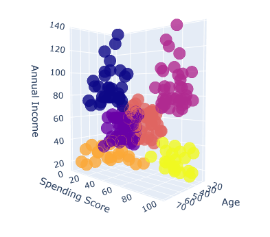
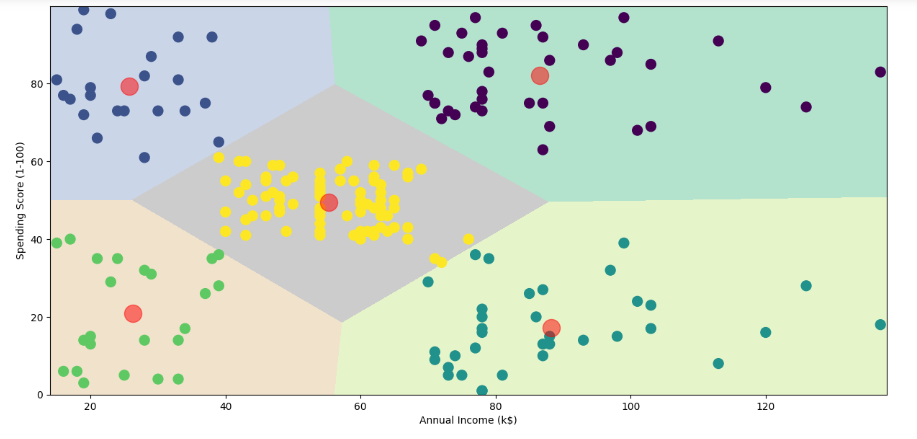

# Mall-Customer-Segmentation

##K Means Clustering for Customer Data
**clustering image**

  

  

**Clustering**
Clustering is the task of dividing the population or data points into a number of groups such that data points in the same groups are more similar
to other data points in the same group than those in other groups. In simple words, the aim is to segregate groups with similar traits and assign them into clusters.

**KMeans Clustering**
K-means clustering is one of the simplest and popular unsupervised machine learning algorithms. You’ll define a target number k, 
which refers to the number of centroids you need in the dataset. A centroid is the imaginary or real location representing the center of the cluster. 
Every data point is allocated to each of the clusters through reducing the in-cluster sum of squares. In other words, the K-means algorithm identifies
k number of centroids, and then allocates every data point to the nearest cluster, while keeping the centroids as small as possible. The ‘means’ in the 
K-means refers to averaging of the data; that is, finding the centroid.

## 📁 **About Dataset**
**Context**
This data set is created only for the learning purpose of the customer segmentation concepts , also known as market basket analysis . I will demonstrate this by using unsupervised ML technique (KMeans Clustering Algorithm) in the simplest form.

**Content**
You are owing a supermarket mall and through membership cards , you have some basic data about your customers like 
Customer ID, age, gender, annual income and spending score.
Spending Score is something you assign to the customer based on your defined parameters like customer behavior and purchasing data.

##Problem Statement
You own the mall and want to understand the customers like who can be easily converge [Target Customers] 
so that the sense can be given to marketing team and plan the strategy accordingly.

##Dataset
https://www.kaggle.com/datasets/vjchoudhary7/customer-segmentation-tutorial-in-python
